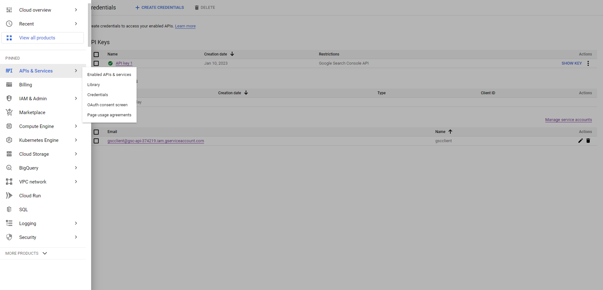
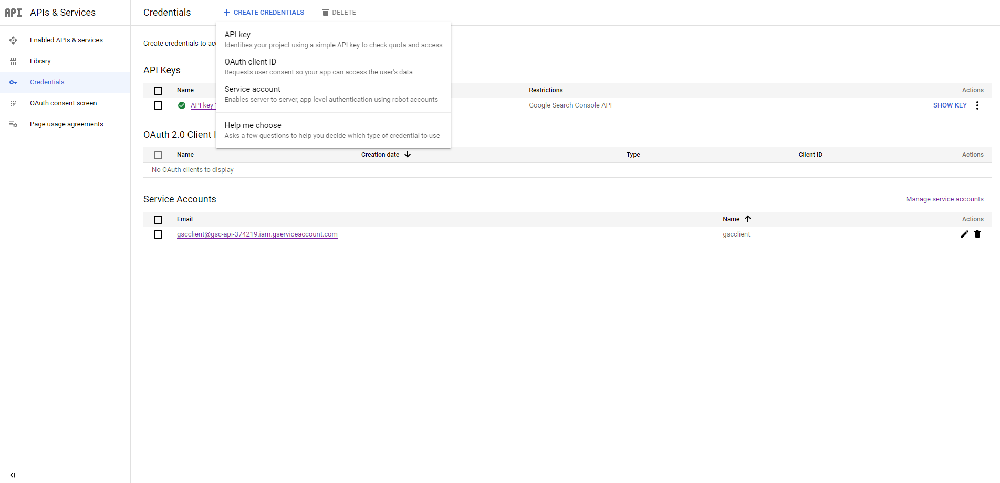
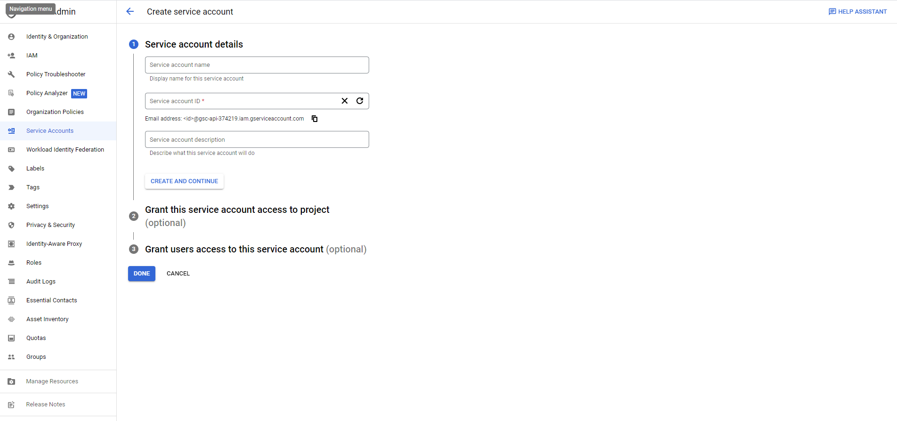
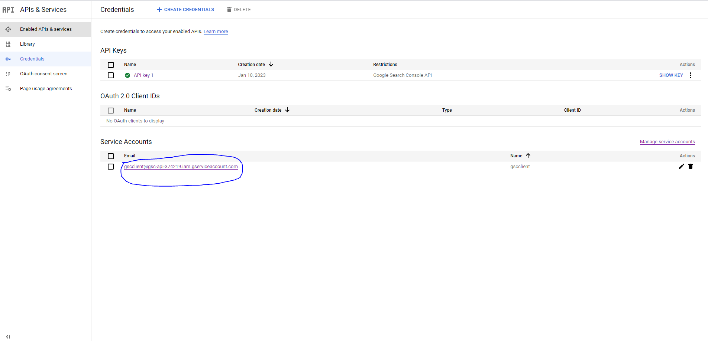
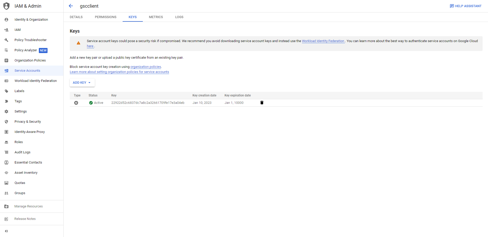

# gsc-api

## Overview
This script is to download external link Urls from Google search console.

## Requirement
Python 3.7+

## Get a key file
1. Open Google Cloud Platform and choose your project.
2. Click `APIs & Services` -> `Credentials` in the left menu.

3. Click `+CREATE CREDENTIALS` and choose `Service account`.

4. Put Service account name and click `Done`.

5. Clicking the created service account will take you to the service account detail page.

6. Click `KEYS` tab and create a key file as a JSON format by clicking `ADD KEY`, and download it.

7. Open Google Search Console and choose the website in the top-left.
8. Move to settings page by clicking `Settings` in the left menu.
9. Click `Users and permissions` and add the service account there with `Full` permission.


## Install dependencies
```commandline
pip install -r requirements.txt
```

## Run
```commandline
python script.py

Site url: https://www.example.com/  (Make sure you have the website in Google Search Console)
Start date: xxxx-xx-xx
End date: xxxx-xx-xx
Key file path: client_secrets.json  (You need to get the key file from Google Cloud Console)
```